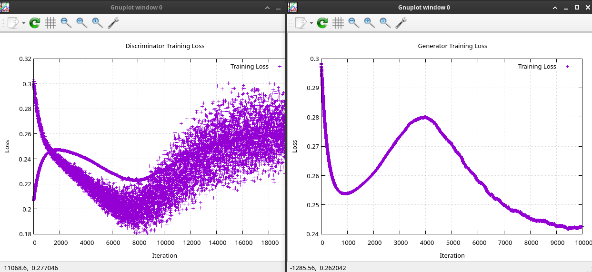
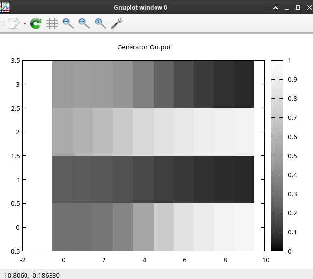

# Simple generative adversarial network (GAN) 

Goal of this GAN is to recognize 1010 pattern

```
[real_data]{1010}
           \                  
           [discriminator] -> 1 or 0
           /
[generator]
```

Generator: learns to create 1010 pattern of values 
Discriminator: tries to determine if values are from real data source of from `generator`

At ~4500 iterations `generator` know how to generate 1010 pattern. 


