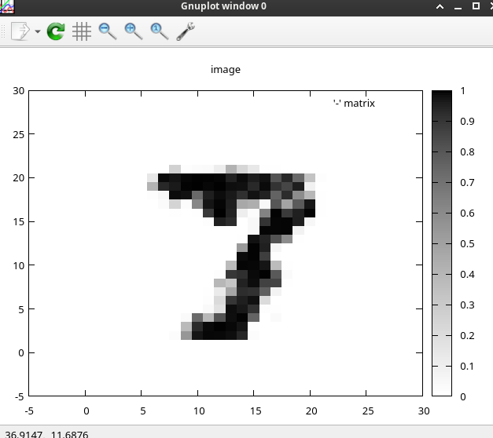
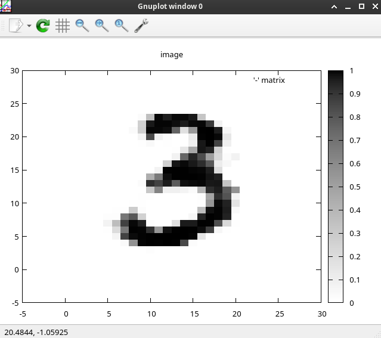
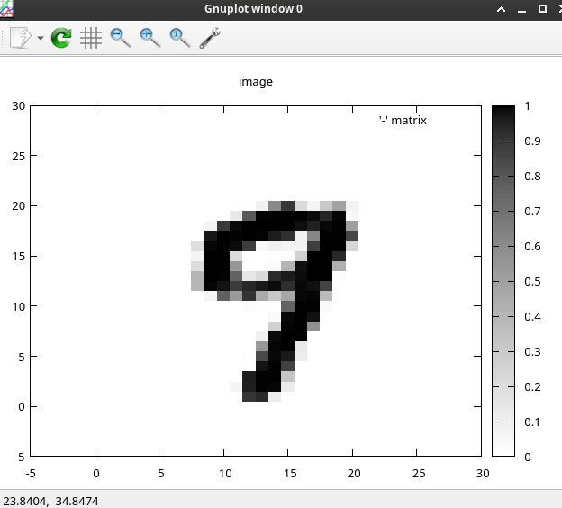
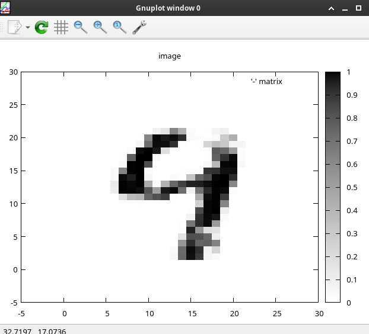
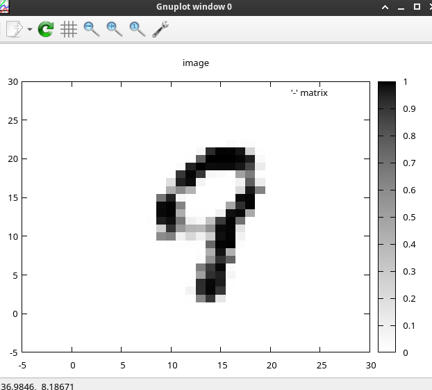
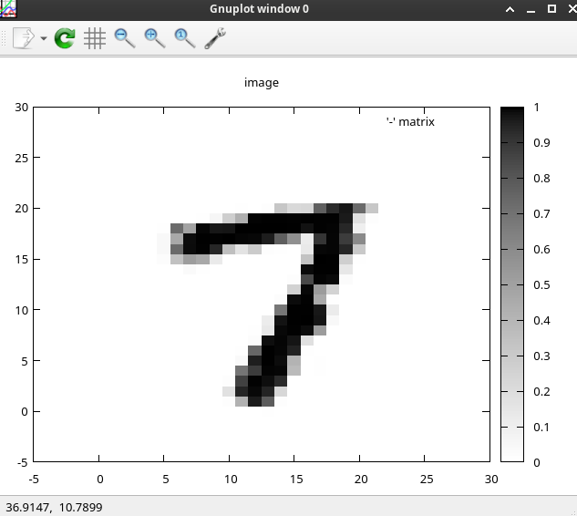
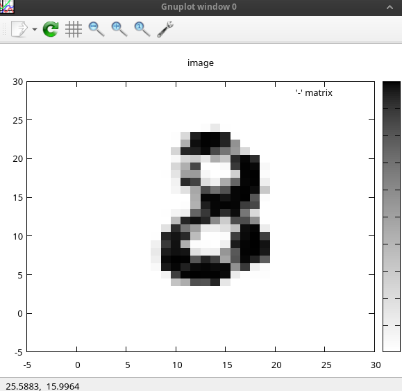
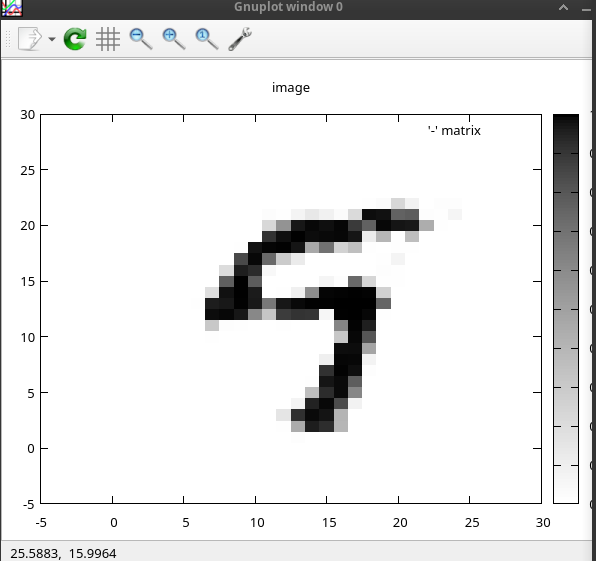
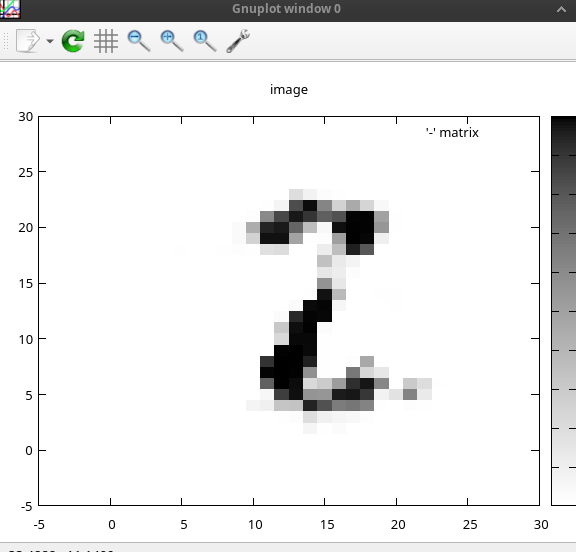
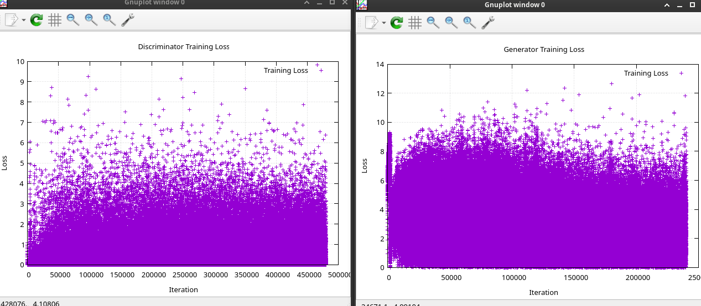

# Handwritten digits 

* Generator: Generates images.

* Discriminator: Detects whether an image is real or fake.

After training the Generator and Discriminator on 60,000 images for 4 epochs, the Generator produces:
 
 
 
 
 
 
 
 
 

Loss:
 