# HumanFaces digits 

* Generator: Generates images.

* Discriminator: Detects whether an image is real or fake.

Code is similar to `HandwrittenDigits`

### Images
https://mmlab.ie.cuhk.edu.hk/projects/CelebA.html

Example of original image, used for training: 

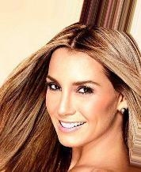

#### Generator generates images after training on 100 images, 4 epoch
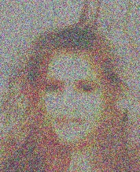
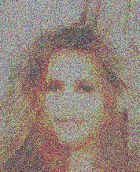
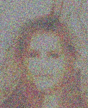
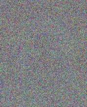
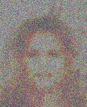
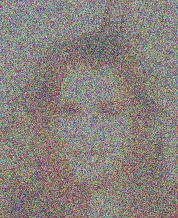
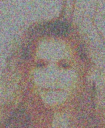
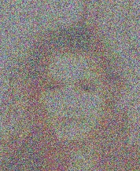
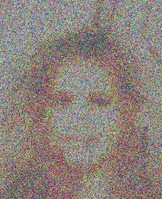
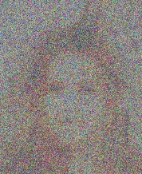

#### Libs
To load/save images used `SkiaSharp` library

