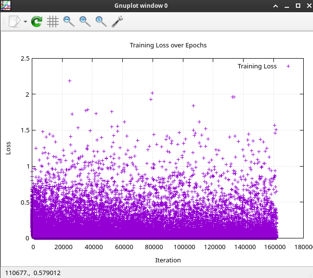

# Convolutional Simple Neural Network

The same 'Simple Neural Network', but with additional convolution filters.

model:
```
image 
    -> [10 kernels(each size 5), 10 feature_maps(each size 12)] -> 
        -> [10 kernels(each size 3), 10 feature_maps(each size 5)] -> 
            -> [fully connected linear layer(size 250)]
                -> [fully connected linear layer(size 10)]
```

Neural Network Performance: 98.61666666666666%

```csharp
// Debug output:

// Label: 6, Predicted: 6[0.9955011], Second predicted: 4[0.00067303877]
// Label: 0, Predicted: 0[0.9972119], Second predicted: 2[0.0017542661]
// Label: 7, Predicted: 7[0.9999666], Second predicted: 8[0.00061977905]
// Label: 8, Predicted: 8[0.99999595], Second predicted: 9[0.0011516035]
// Label: 9, Predicted: 9[0.9933734], Second predicted: 7[0.0031509795]
// Label: 2, Predicted: 2[0.999483], Second predicted: 8[0.23067267]
// Label: 9, Predicted: 9[0.98020875], Second predicted: 7[0.01554027]
// Label: 5, Predicted: 5[0.9999161], Second predicted: 8[0.0006054291]
// Label: 1, Predicted: 1[0.99913543], Second predicted: 7[0.0049620615]
// Label: 8, Predicted: 8[0.9999995], Second predicted: 3[0.0006777902]
// Label: 3, Predicted: 3[0.99992824], Second predicted: 8[0.0070069963]
// Label: 5, Predicted: 5[0.99940765], Second predicted: 8[0.005628047]
// Label: 6, Predicted: 6[0.99973315], Second predicted: 5[0.00039780219]
// Label: 8, Predicted: 8[0.9896432], Second predicted: 9[0.0003862773]
// Neural Network Performance: 98.61666666666666%
// Number of training images: 54000
// Number of test images: 6000
// Number of epochs: 3
```

