# Convolutional GAN Human Faces

This project implements a convolutional GAN to generate human faces. The dataset used is the CelebA dataset, which contains over 200k images of celebrity faces. The images are resized to 128x128 pixels for training.

```csharp
// ...
// Completed 9970 images
// Completed 9980 images
// Completed 9990 images
// Real Data Prediction: 0.9999913
// Fake Data Prediction: 0.008244956
```

### Trained to 10k images.

Generator training loss: 
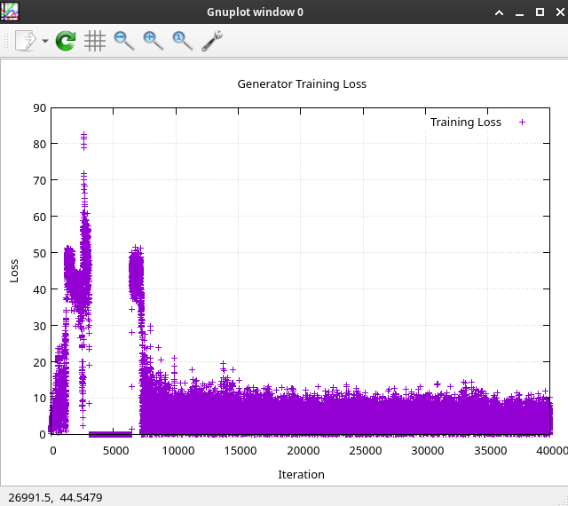

Discriminator training loss:
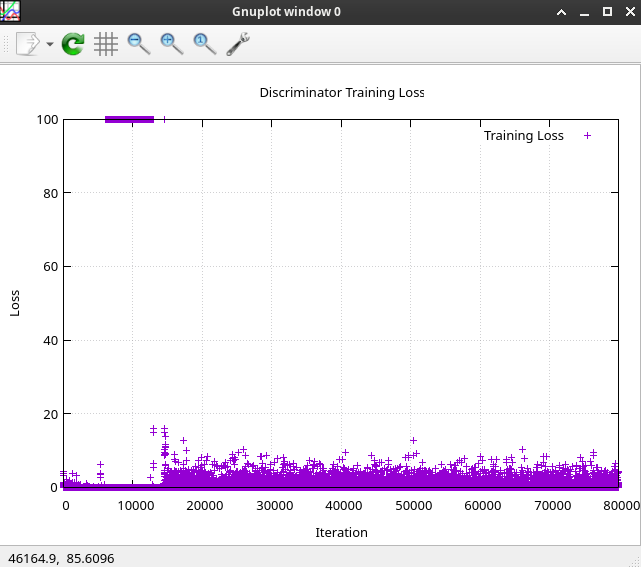


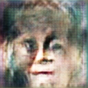
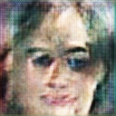
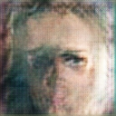

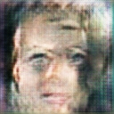
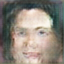
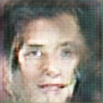
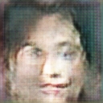
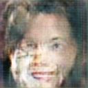

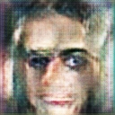
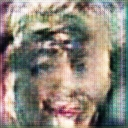
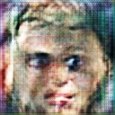
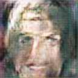

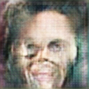

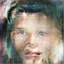
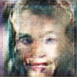

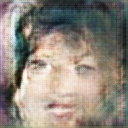
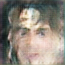

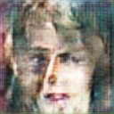        
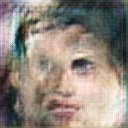
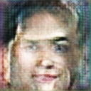
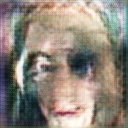
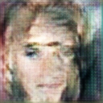

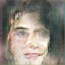
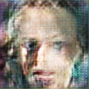
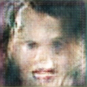
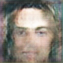
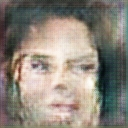
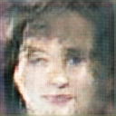
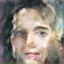        
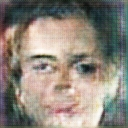
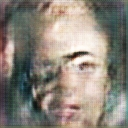
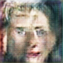

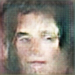 
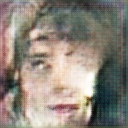
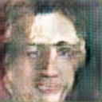
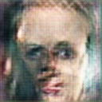

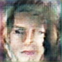

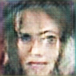
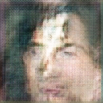

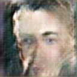
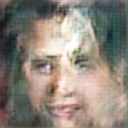
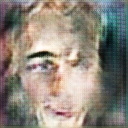
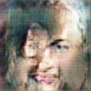
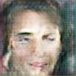

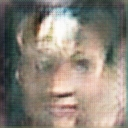

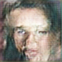
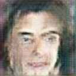
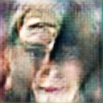


    


    


