# Handwritten digits 

Conditional GAN (Conditional Generative Adversarial Network) 

* Generator: Generates images, conditioned on a label input.

* Discriminator: Detects whether an image is real or fake, also conditioned on a label input.

Training loss of the generator and discriminator:
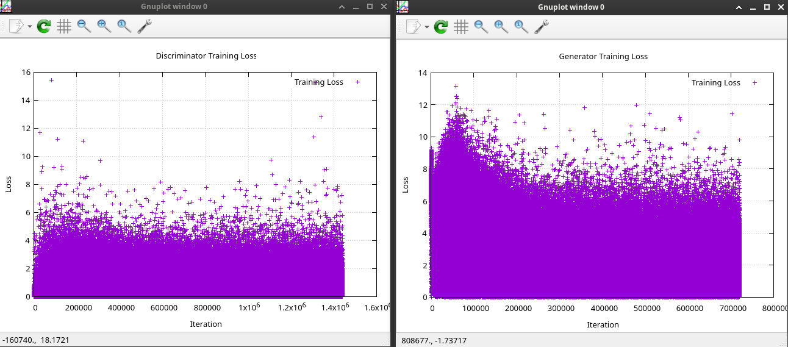

Generated images after training:

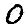
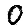
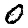
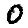

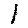
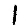
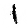
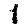
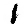

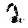
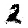
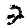
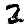
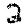

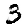
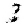
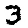
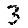
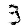

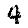
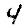

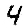
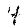

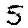
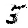
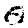
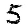
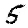

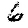
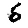
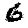
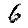
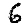

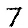
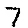
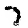
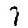
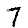

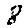
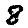
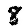
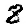
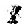

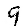
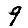
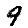
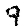
